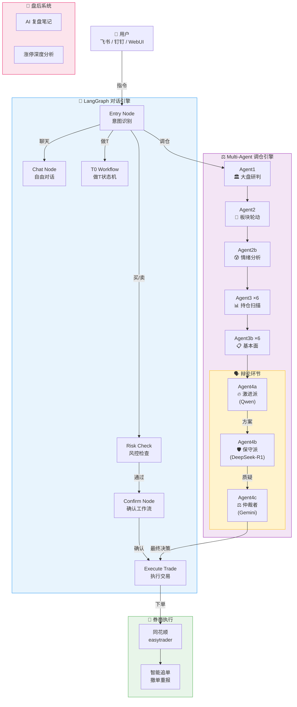
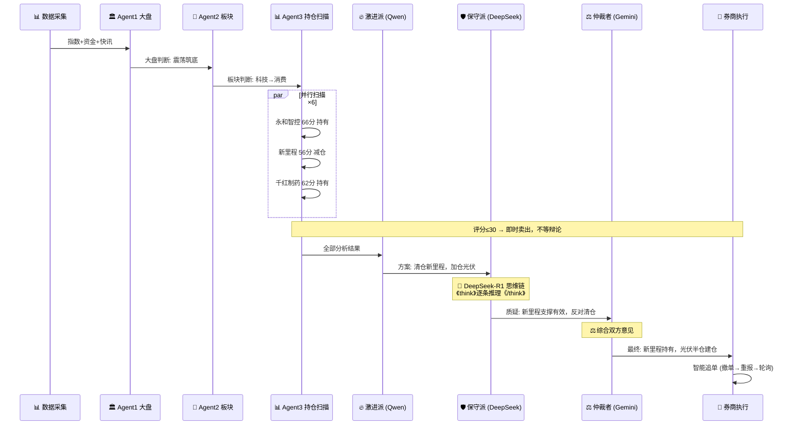
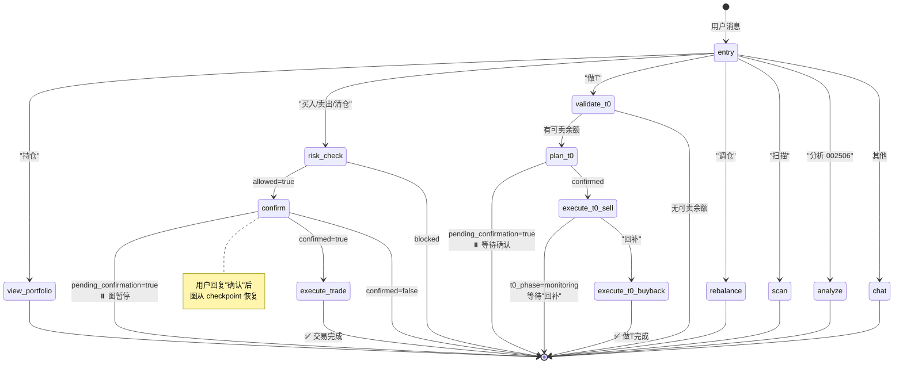
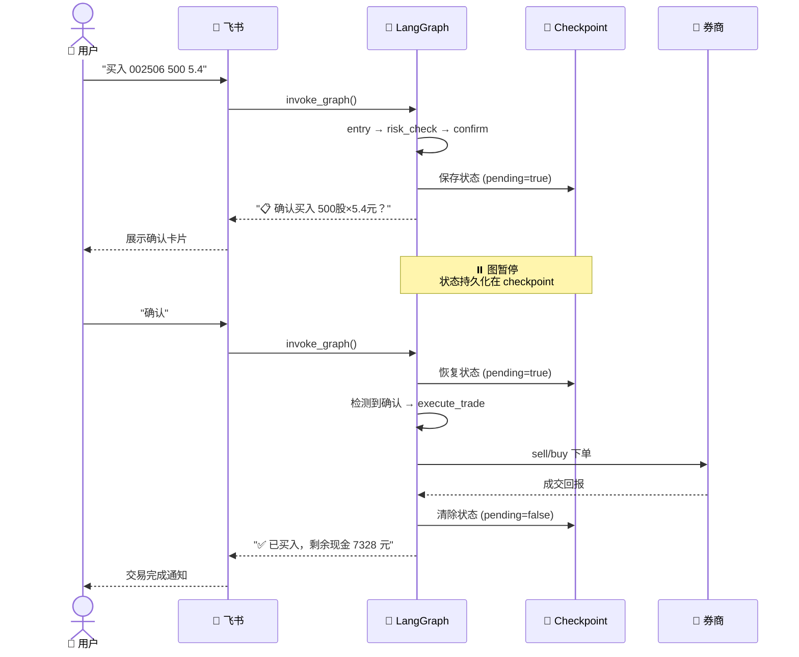
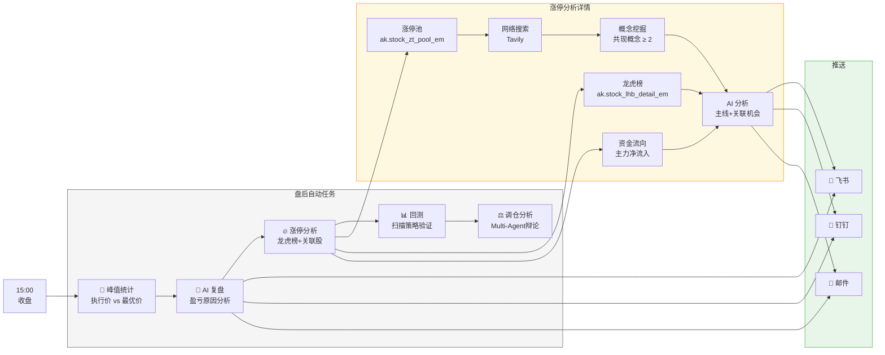
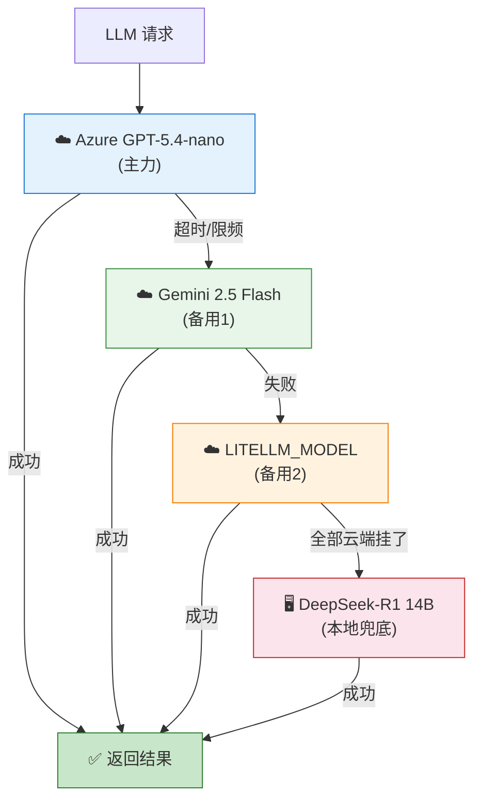

# 文章配图（Mermaid 格式）

> 使用 https://mermaid.live 在线渲染为 PNG/SVG，或用 VS Code Mermaid 插件预览

---

## 图1：系统架构全景图

---

## 图2：Multi-Agent 辩论流程

---

## 图3：LangGraph 对话状态机

---

## 图4：确认工作流时序

---

## 图5：盘后分析流程

---

## 图6：模型降级链

---

## 使用方式

1. 打开 https://mermaid.live
2. 粘贴任意图的 Mermaid 代码
3. 右上角导出为 PNG / SVG
4. 插入到文章对应位置

或者使用 VS Code 的 **Markdown Preview Mermaid Support** 插件直接预览。
