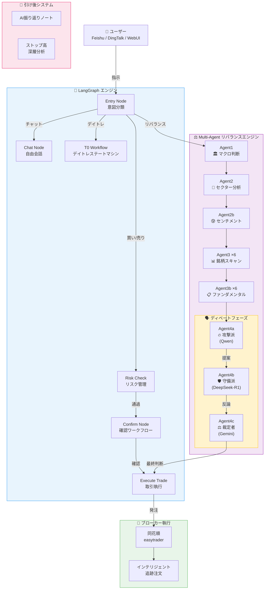
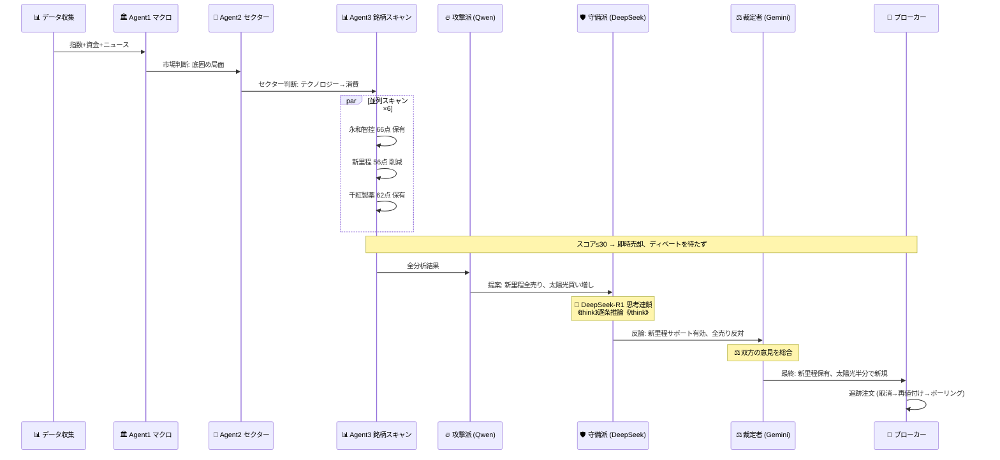
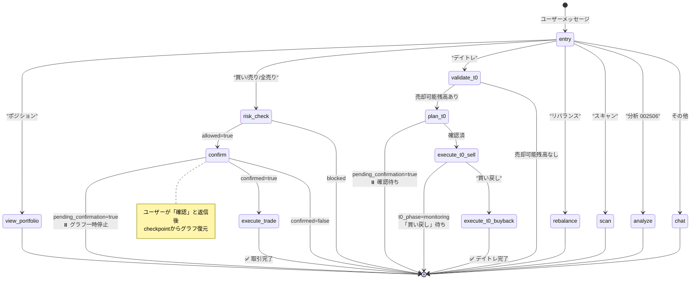
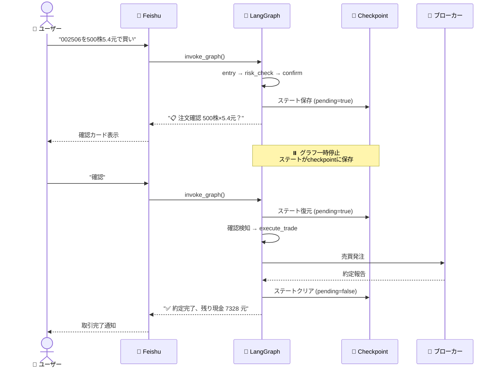
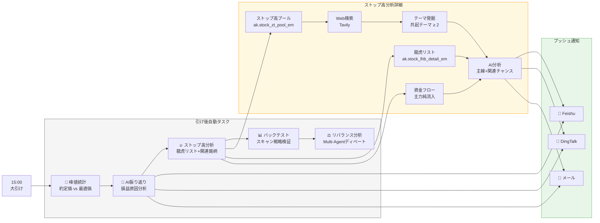
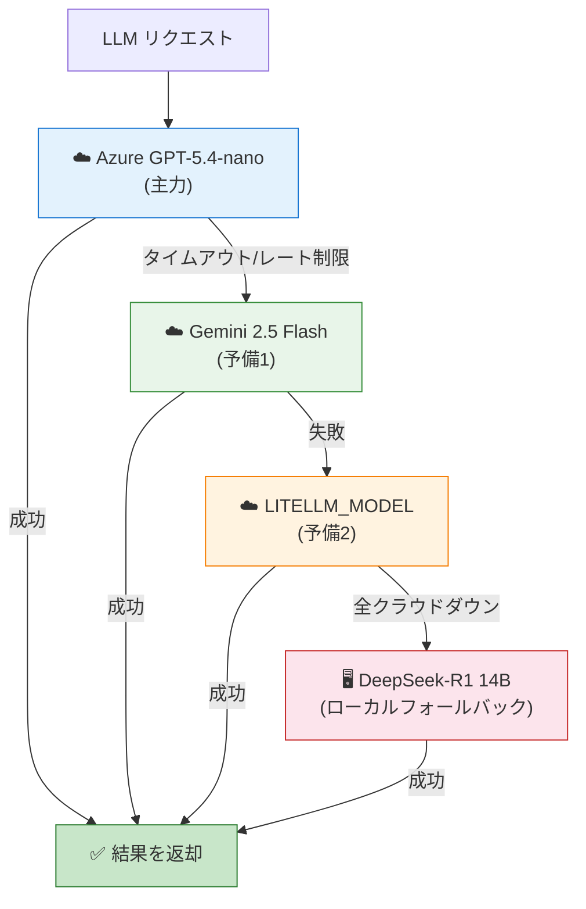

# 記事配図（Mermaid形式）

> https://mermaid.live でPNG/SVGにレンダリング、またはVS Code Mermaid拡張でプレビュー

---

## 図1：システムアーキテクチャ全景

---

## 図2：Multi-Agent ディベートフロー

---

## 図3：LangGraph 会話ステートマシン

---

## 図4：確認ワークフローのシーケンス

---

## 図5：引け後分析フロー

---

## 図6：モデルデグレードチェーン

---

## 使い方

1. https://mermaid.live を開く
2. 任意の図のMermaidコードを貼り付け
3. 右上からPNG / SVGでエクスポート
4. 記事の該当箇所に挿入

または VS Code の **Markdown Preview Mermaid Support** 拡張で直接プレビュー可能です。
